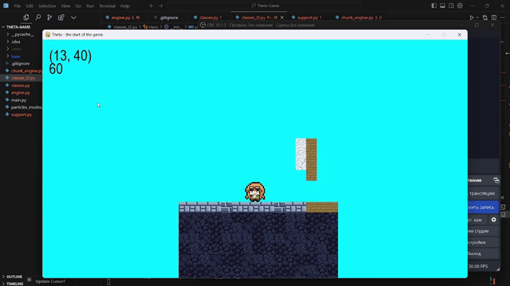

## NNLG - No Name Local Game

### Images and screenshots
Please wait for images to load... They`re quite slow for some reason. Or open them manually =)




### Features
- Working chunk system
- PyTMX support
- Easy map changing
- Dialogues and floating text boxes
- Particles
- Other...

### Start here

#### Windows
```bash
# Clone repo
git clone https://github.com/Nizier193/Theta-Game.git
cd Theta-Game

# Create your venv and activate it
python -m venv .venv
./venv/Scripts/activate

# Install requirements (any python versions)
pip install -r requirements.txt

# Run manually
python main.py

# If everything is set up correctly it should work =)
```

#### Linux
```bash
Same for linux i dont want to write there bruh
```

### Roadmap
- [x] Debug a hella ton of errors
- [x] Make code just a little bit more undertandable
- [x] Debug chunk system
- [x] Made images and custom furniture
- [x] Debug particles
- [ ] Make inventory
- [ ] Make quest system
- [x] Make fancy map for the game
- [ ] Make map for game
- [ ] Make dialogue system
- [ ] Make shadows and lights
- [ ] Make scenario support

### For what?
- Idk, just for fun, I return to this project once in a while to continue it and then to abandon it for another forever.
- Now it looks better =)
